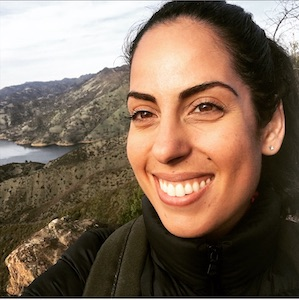

<!DOCTYPE html>
<html lang="en">

<body>

  

    

      

        <h1>Angela Nazarian</h1>
        <h2> PhD Candidate - Center for Mind and Brain - University of California, Davis</h2>
      

      

        
<a href="pages/Nazarian_CV.pdf">Download my CV</a>

        
<a href="www.linkedin.com/in/angela-nazarian"; target="_top">LinkedIn</a>

        
<a href="https://scholar.google.com/citations?user=iH_c3aAAAAAJ&hl=en" ; target="_top">Google Scholar</a>

        
<a href="https://github.com/peachypunk" ; target="_top">GitHub</a>

      

      

      
      

    

            <h2 class="media-heading">About Me</h2>
            
Angela Nazarian is a Psychology PhD candidate in the lab of <a href="https://atonal.ucdavis.edu/people/">Dr. Petr Janata</a> at the University of          California, Davis. Her research uses naturalistic stimuli to examine human memory across the lifespan. This work utilizes factors including nostalgia and modality to address questions such as why music reminds us of the past and how it can be used to elicit memories in healthy individuals as well as people with memory disorders.
 

   
Angela is currently interning as a User Experience Researcher at Google, and previously interned as a Research Scientist at Spotify in 2018 where she conducted user research to examine how individuals request music through conversational voice queries. Prior to joining UC Davis, Angela was also involved in the development and implementation of immersive technologies at the <a href="https://ict.usc.edu">USC Institute for Create Technologies</a>. Her research there included multimodal prediction of psychological disorders, assessment of responsive virtual museum tour guides, and development of virtual training agents for cross-cultural negotiation scenarios. 

The experiences that Angela has accrued across various academic fields, the music industry, and technology inspire her interdisciplinary approach to studying human behavior and cognition. She is passionate about applying this keen insight and creative problem solving to conduct thoughtful and innovative research for the greater good.

         
   <h2 class="media-heading">Contact</h2>
   
Email: <a href="mailto:anazarian@ucdavis.edu">anazarian@ucdavis.edu</a>

   
Angela Nazarian 
   Center for Mind and Brain 
   267 Cousteau Place 
   Davis, CA 95616 

